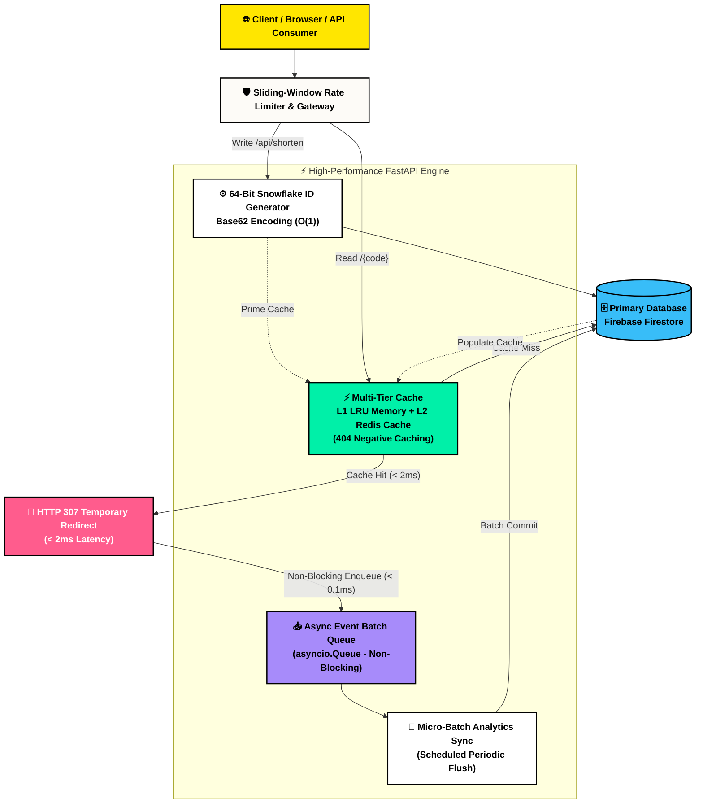

# ⚡ High-Scale Distributed URL Shortener & Analytics Platform

A high-performance, fault-tolerant, and secure URL shortening and analytics platform built with **FastAPI (Python)**, **Next.js 14+ (TypeScript)**, **Firebase Firestore**, **Redis**, and an **Asynchronous Micro-Batching Event Pipeline**.

Designed from the ground up using modern **Systems Design** best practices to handle high read/write throughput, eliminate database contention on redirects, enforce multi-tier rate limiting, and provide sub-millisecond redirection latency.

---

## Executive Summary & Architecture Highlights

> **TL;DR:** A distributed URL shortener designed like Bitly & TinyURL that replaces database bottlenecking with Twitter Snowflake $O(1)$ key generation, non-blocking asynchronous click-stream buffering, multi-tier negative caching, and a bold Neo-Brutalist UI.

### ⚡ System Highlights at a Glance

| Engineering Pillar | Problem Solved | How It Works | Impact |
|---|---|---|---|
| **Distributed Snowflake Keygen** | Collision retries & DB increment locks | 64-bit timestamp + Node ID + Sequence with Base62 encoding | **$O(1)$ generation, 0 DB queries**, zero collision risk |
| **Decoupled Event Pipeline** | Write latency slowing down HTTP redirects | `asyncio.Queue` buffers visits and writes in scheduled micro-batches | **< 2ms redirect latency**; Firestore never blocks user |
| **Multi-Tier Negative Caching** | Cache Penetration attacks on non-existent links | L1 In-Memory LRU + L2 Redis caching 404 results for 30s | **Database shielded** against DoS spam requests |
| **Sliding-Window Rate Limiter** | Burst traffic & brute-force passcode cracking | Redis sliding log with automatic thread-safe in-memory fallback | Returns RFC standard `X-RateLimit-*` & `Retry-After` |
| **Two-Tier Portal & Neo-Brutalism** | Boring interfaces & confusing permissions | Public Community Feed (`/links`) + Private Dashboard (`/dashboard`) | High-contrast, tactile UI with locked passcode gate |

```
                       [ 60-Second System Dataflow ]

  [ Client ] ──────────────► [ Sliding Window Rate Limiter ] 
                                           │ (Passed)
                                           ▼
   [ GET /{code} ] ──────────► [ L1/L2 Cache Layer ] ──(Hit)──► HTTP 307 Redirect (<2ms)
                                     │ (Miss)                       │
                                     ▼                              ▼
                             [ Firestore DB ]            [ Async Batch Event Queue ]
                                                                    │ (Non-blocking)
                                                                    ▼
                                                         [ Micro-Batch Analytics Write ]
```

---

## 📑 Table of Contents
1. [1-Minute WOW](#-1-minute-wow-executive-summary--architecture-highlights)
2. [Key Features](#-key-features)
3. [Systems Design & Visual Architecture](#-systems-design--visual-architecture)
4. [Live API Demo & Swagger Reference](#-live-api-demo--swagger-reference)
5. [UI Visual Tour & Page Directory](#-ui-visual-tour--page-directory)
6. [Deep Dive into Backend Engineering](#-deep-dive-into-backend-engineering)
7. [Rate Limiting Policies & Tiers](#-rate-limiting-policies--tiers)
8. [Project Directory Structure](#-project-directory-structure)
9. [Prerequisites & Environment Variables](#-prerequisites--environment-variables)
10. [Installation & Local Setup](#-installation--local-setup)
11. [Running Automated Tests](#-running-automated-tests)

---

## 🌟 Key Features

### 🔗 URL Management
- **Instant Shortening**: Generates collision-free 6–7 character alphanumeric short links ($O(1)$ write).
- **Custom Slugs / Aliases**: Custom vanity aliases with regex validation (`3-30` chars).
- **Time-Based Expiration**: Automatic expiration timestamps with automatic background garbage collection.
- **Click Limits**: Enforce maximum allowed clicks before permanent expiration.
- **Password Protection**: Salted bcrypt password protection for sensitive links.
- **Dynamic QR Code Generation**: High-resolution PNG QR codes generated on-the-fly.

### 📊 Real-Time Analytics & User Dashboard
- **Click Tracking**: Tracks total visits, daily click time-series, referrers, operating systems, browsers, and devices.
- **GDPR Privacy Compliance**: Client IP addresses are hashed using SHA-256 before persistence.
- **User Dashboard**: Secure dashboard to manage links, copy URLs, view QR codes, inspect real-time click metrics, and delete links.

### 🛡️ High-Performance Architecture & Security
- **Sub-2ms Redirections**: Multi-level caching (Redis L2 + In-Memory LRU L1) serves hot links without database queries.
- **Negative Caching**: Caches 404s to eliminate **Cache Penetration Attacks** on spam/non-existent links.
- **Decoupled Analytics**: Non-blocking in-memory queue (`asyncio.Queue`) flushes click events in micro-batches, eliminating write delays on redirects.
- **Distributed Sliding Window Rate Limiting**: Multi-tier rate limiting backed by Redis with thread-safe in-memory fallback.
- **$O(1)$ Developer API Keys**: High-entropy keys (`sk_live_<key_id>.<secret>`) with constant-time SHA-256 verification and tier-based quotas.

---

## 🏛️ Systems Design & Visual Architecture

### 📊 Clean Architecture Diagram



---

## 📡 Live API Demo & Swagger Reference

The FastAPI backend includes interactive Swagger documentation with built-in schema validation, response headers, and testing capabilities:

* **Interactive Swagger UI:** 👉 [`http://localhost:8000/docs`](http://localhost:8000/docs)
* **ReDoc Documentation:** 👉 [`http://localhost:8000/redoc`](http://localhost:8000/redoc)
* **OpenAPI Specification:** 👉 [`http://localhost:8000/openapi.json`](http://localhost:8000/openapi.json)

### 📋 Interactive Endpoint Matrix

| Method | Endpoint | Description | Rate Limit Tier | Response Time |
|---|---|---|---|---|
| `GET` | `/{code}` | Immediate short URL redirection | 300/min (Anon) | **< 2ms** (L1/L2) |
| `POST` | `/api/shorten` | Snowflake short code creation | 20/min (Anon) | **~15ms** |
| `GET` | `/api/public-links` | Community public link feed | 120/min | **< 5ms** |
| `POST` | `/api/verify/{code}` | Passcode verification gate | 10/min (Anti-Brute) | **~25ms** (Bcrypt) |
| `GET` | `/api/qr/{code}` | Binary PNG QR generation | 30/min | **~10ms** |
| `GET` | `/api/stats/{code}/detailed` | Detailed analytics breakdown | 120/min | **~30ms** |
| `POST` | `/api/keys/generate` | Generate $O(1)$ developer API key | Auth Required | **~20ms** |
| `GET` | `/api/health` | System diagnostics & cache status | Unlimited | **< 1ms** |

### 💻 Quick API Test via cURL

```bash
# 1. Shorten a URL with Custom Alias & Password Protection
curl -X POST "http://localhost:8000/api/shorten" \
     -H "Content-Type: application/json" \
     -d '{
       "long_url": "https://github.com/Shraman91/URLShortener",
       "custom_alias": "my-cool-repo",
       "password": "secretpasscode123"
     }'

# 2. Inspect System Health & Cache Backend
curl -X GET "http://localhost:8000/api/health"

# 3. Fetch Public Community Feed
curl -X GET "http://localhost:8000/api/public-links?limit=10"
```

---

## 🖼️ UI Visual Tour & Page Directory

The web client is built with **Next.js 14+**, **TypeScript**, and **Neo-Brutalist design tokens**:

| Page / Route | Role | Highlights |
|---|---|---|
| **Home (`/`)** | Shorten Generator | Snowflake generator, instant clipboard copy, dynamic QR code preview |
| **Community (`/links`)** | Public Link Feed | Real-time search, category filter pills (`All`, `Open`, `Protected`), QR modal |
| **Dashboard (`/dashboard`)** | Creator Console | Authenticated management, click counters, OS/Device/Referrer breakdown |
| **Passcode Safe (`/[code]/password`)** | Security Gate | Bcrypt hash verification, brute-force rate limiter |
| **Custom 404 (`/not-found`)** | Error Diagnostic | Diagnostics box, negative-cache anti-penetration info, quick links |
| **Link Expired (`/expired`)** | Deactivation Banner | Auto-purged notification for click-capped or time-expired links |

---

## 🔬 Deep Dive into Backend Engineering

### 1. Distributed Snowflake Base62 ID Generation ([`keygen.py`](file:///c:/Users/vkdgs/OneDrive/Desktop/Projects/URLShortener/url-shortener/backend/keygen.py))
Instead of using random generation with a retry loop (which suffers from write collisions and database roundtrips under high concurrency), we implement a **64-bit distributed Snowflake ID generator**:
- **41 bits**: Millisecond timestamp since custom epoch.
- **10 bits**: Machine / Worker ID (supports up to 1,024 distributed nodes).
- **12 bits**: Sequence counter (generates up to 4,096 unique IDs per millisecond per worker).
- **Base62 Encoding**: Output integer is converted into a 6–7 character alphanumeric string (`[0-9a-zA-Z]`).
- **Performance**: $O(1)$ zero-collision creation with **0 database queries** required during generation.

### 2. Multi-Level Caching & Cache-Penetration Defense ([`cache.py`](file:///c:/Users/vkdgs/OneDrive/Desktop/Projects/URLShortener/url-shortener/backend/cache.py))
- **L1 In-Memory LRU**: Local micro-cache storing hot links and negative 404 cache.
- **L2 Redis Cache**: Shared distributed cache cluster storing URL metadata with configurable TTL.
- **Negative Caching**: Non-existent codes are cached for 30 seconds (`set_nonexistent`) to prevent denial-of-service attempts that flood non-existent keys to exhaust database read limits.

### 3. Decoupled Asynchronous Analytics Ingestion ([`analytics_queue.py`](file:///c:/Users/vkdgs/OneDrive/Desktop/Projects/URLShortener/url-shortener/backend/analytics_queue.py))
- Traditional implementations perform synchronous writes (`db.update` + `db.insert`) on every redirect, adding 50–150ms of network latency to the user redirect.
- In our system, the redirect handler pushes an event into `AsyncAnalyticsQueue` in **$<0.1\text{ms}$** and immediately issues an `HTTP 307` redirect.
- A background worker aggregates events and flushes them in atomic micro-batches (up to 400 operations per batch) to Firestore.
- Handles graceful application shutdown to flush any in-flight buffer before termination.

### 4. $O(1)$ API Key Authentication Service ([`auth_service.py`](file:///c:/Users/vkdgs/OneDrive/Desktop/Projects/URLShortener/url-shortener/backend/auth_service.py))
- Composite key structure: `sk_live_<key_id>.<secret>`.
- Direct $O(1)$ document lookup by `key_id`, eliminating $O(N)$ full-collection database scanning.
- Constant-time validation using `hmac.compare_digest` with SHA-256 secret digests.
- Verified credentials are cached in memory with a 5-minute TTL.

---

## 🛡️ Rate Limiting Policies & Tiers

The rate limiting engine ([`rate_limiter.py`](file:///c:/Users/vkdgs/OneDrive/Desktop/Projects/URLShortener/url-shortener/backend/rate_limiter.py)) uses a **Sliding Window Log** algorithm backed by Redis (with thread-safe in-memory fallback):

| Identity / Tier | Action | Rate Limit | Sliding Window | Scope / Description |
|---|---|---|---|---|
| **Anonymous (IP)** | Shorten Link | **20 req** | 60 sec | Prevents spamming creations |
| **Anonymous (IP)** | Redirect | **300 req** | 60 sec | High-throughput browsing |
| **Anonymous (IP)** | Password Verify | **10 req** | 60 sec | Brute-force protection on protected links |
| **Anonymous (IP)** | QR Generation | **30 req** | 60 sec | Image generation protection |
| **Authenticated User** | Shorten Link | **120 req** | 60 sec | Authenticated dashboard users |
| **Authenticated User** | Redirect | **1,000 req** | 60 sec | High volume link access |
| **API Tier: Basic** | All Endpoints | **1,000 req** | 1 hour | 60 req/min burst allowance |
| **API Tier: Pro** | All Endpoints | **10,000 req** | 1 hour | 300 req/min burst allowance |
| **API Tier: Enterprise**| All Endpoints | **100,000 req** | 1 hour | 1,200 req/min burst allowance |

### Rate Limit Response Headers
Every HTTP response includes standard rate limiting headers:
```http
X-RateLimit-Limit: 120
X-RateLimit-Remaining: 119
X-RateLimit-Reset: 1714930200
Retry-After: 45
```

---

## 📂 Project Directory Structure

```
URLShortener/
├── backend/
│   ├── analytics_queue.py     # Asynchronous non-blocking click buffer & batch worker
│   ├── auth_service.py        # O(1) API Key generation & SHA-256 authentication
│   ├── cache.py               # Redis & In-Memory LRU cache with negative caching
│   ├── firebase.py            # Firebase Admin SDK initialization
│   ├── firestore.rules        # Production Firestore security rules
│   ├── keygen.py              # Snowflake Base62 collision-free ID generator
│   ├── main.py                # FastAPI routes, middleware, lifespan handlers
│   ├── models.py              # Pydantic schemas for request/response validation
│   ├── rate_limiter.py        # Multi-tier Sliding Window rate limiting engine
│   ├── requirements.txt       # Python package dependencies
│   ├── test_system.py         # Automated test suite for backend components
│   └── utils.py               # GDPR IP hashing, password hashing, user-agent parser
│
└── frontend/
    ├── app/
    │   ├── [code]/password/   # Password-protected link unlock screen
    │   ├── dashboard/         # Link management dashboard & analytics charts
    │   ├── expired/           # Expired/limit-reached landing screen
    │   ├── login/             # Firebase email/password & Google auth screen
    │   ├── layout.tsx         # Root layout with responsive navigation
    │   └── page.tsx           # Home page URL shortener UI & live QR generator
    ├── context/               # AuthContext for client Firebase auth state
    └── package.json           # Next.js dependencies
```

---

## ⚙️ Prerequisites & Environment Variables

### Prerequisites
- **Python 3.10+**
- **Node.js 18+ & npm**
- **Firebase Project** (Firestore + Firebase Authentication enabled)
- *(Optional)* **Redis 6+** (for distributed multi-node rate limiting and caching)

### Backend Environment (`backend/.env` or system environment)
```ini
BASE_URL=http://localhost:8000
FRONTEND_URL=http://localhost:3000
REDIS_URL=redis://localhost:6379/0
```

### Frontend Environment (`frontend/.env.local`)
```ini
NEXT_PUBLIC_FIREBASE_API_KEY=your_firebase_api_key
NEXT_PUBLIC_FIREBASE_AUTH_DOMAIN=your_project_id.firebaseapp.com
NEXT_PUBLIC_FIREBASE_PROJECT_ID=your_project_id
NEXT_PUBLIC_FIREBASE_STORAGE_BUCKET=your_project_id.appspot.com
NEXT_PUBLIC_FIREBASE_MESSAGING_SENDER_ID=your_sender_id
NEXT_PUBLIC_FIREBASE_APP_ID=your_app_id
NEXT_PUBLIC_API_URL=http://localhost:8000
```

---

## 🚀 Installation & Local Setup

### 1. Firebase Service Account Setup
1. Go to the [Firebase Console](https://console.firebase.google.com/) > Project Settings > **Service accounts**.
2. Click **Generate new private key** and download the JSON file.
3. Save this file as `backend/serviceAccountKey.json`.

### 2. Backend Setup (FastAPI)
```bash
# Navigate to backend directory
cd backend

# Create and activate a Python virtual environment
python -m venv venv

# Windows:
venv\Scripts\activate
# Linux/macOS:
source venv/bin/activate

# Install required dependencies
pip install -r requirements.txt

# Start the FastAPI server
uvicorn main:app --reload --port 8000
```
Backend will be live at: `http://localhost:8000`  
Interactive Swagger API docs: `http://localhost:8000/docs`

*(Optional)* Start Redis using Docker:
```bash
docker run -d -p 6379:6379 --name redis-url-shortener redis:alpine
```

### 3. Frontend Setup (Next.js)
```bash
# In a new terminal, navigate to frontend directory
cd frontend

# Install Node modules
npm install

# Start Next.js development server
npm run dev
```
Frontend will be live at: `http://localhost:3000`

---

## 📡 API Reference & Examples

### 1. Shorten a URL
`POST /api/shorten`

**Request Headers:**
- `Authorization: Bearer <FIREBASE_ID_TOKEN>` (Optional)

**Request Body:**
```json
{
  "long_url": "https://en.wikipedia.org/wiki/System_design",
  "custom_alias": "system-design",
  "expires_at": "2026-12-31T23:59:59Z",
  "max_clicks": 500,
  "password": "optional_secure_password"
}
```

**Response (`200 OK`):**
```json
{
  "short_code": "system-design",
  "short_url": "http://localhost:8000/system-design",
  "long_url": "https://en.wikipedia.org/wiki/System_design"
}
```

---

### 2. Redirect to Long URL
`GET /{code}`

**Response:** `HTTP 307 Temporary Redirect` -> `Location: https://en.wikipedia.org/wiki/System_design`

---

### 3. Generate a Developer API Key
`POST /api/keys/generate`

**Request Headers:**
- `Authorization: Bearer <FIREBASE_ID_TOKEN>` (Required)

**Request Body:**
```json
{
  "name": "Production Service Key",
  "tier": "pro"
}
```

**Response (`200 OK`):**
```json
{
  "api_key": "sk_live_a1b2c3d4e5f6.XYZ1234567890abcdef...",
  "key_id": "a1b2c3d4e5f6",
  "name": "Production Service Key",
  "rate_limit_tier": "pro",
  "created_at": "2026-10-05T19:46:00Z",
  "message": "Store this API key securely. You will not be able to view the full key again."
}
```

---

### 4. Bulk Shorten via API Key
`POST /api/bulk-shorten`

**Request Headers:**
- `X-API-Key: sk_live_<key_id>.<secret>` (Required)

**Request Body:**
```json
{
  "long_urls": [
    "https://example.com/article-1",
    "https://example.com/article-2"
  ]
}
```

---

### 5. Check System Health & Observability
`GET /api/health`

**Response (`200 OK`):**
```json
{
  "status": "healthy",
  "cache_backend": "InMemory-LRU",
  "rate_limiter_backend": "InMemory-Sliding-Window",
  "analytics_queue_size": 0,
  "timestamp": "2026-10-05T19:48:00.000000"
}
```

---

## 🔒 Firestore Data Models & Security Rules

### Collections Schema
- `urls/{code}`:
  - `long_url`: String
  - `created_at`: ISO timestamp
  - `clicks`: Integer (total click count)
  - `owner_uid`: String or null
  - `is_password_protected`: Boolean
  - `password_hash`: String (optional)
  - `expires_at`: ISO timestamp (optional)
  - `max_clicks`: Integer (optional)
- `urls/{code}/clicks/{clickId}`:
  - `timestamp`: ISO timestamp
  - `referrer`: String
  - `browser`: String
  - `device`: String
  - `os`: String
  - `ip_hash`: String (GDPR-anonymized)
- `api_keys/{keyId}`:
  - `key_id`: String
  - `secret_hash`: String (SHA-256)
  - `owner_uid`: String
  - `rate_limit_tier`: "basic" | "pro" | "enterprise"
  - `usage_count`: Integer
  - `is_active`: Boolean

### Production Security Rules (`firestore.rules`)
```javascript
rules_version = '2';
service cloud.firestore {
  match /databases/{database}/documents {
    // All direct client-side reads/writes are blocked.
    // All operations are safely orchestrated through the backend Admin SDK.
    match /{document=**} {
      allow read, write: if false;
    }
  }
}
```

---

## 🧪 Running Automated Tests

A dedicated test suite ([`test_system.py`](file:///c:/Users/vkdgs/OneDrive/Desktop/Projects/URLShortener/url-shortener/backend/test_system.py)) tests all backend components:
- **Snowflake & Base62 Collision Test**: Generates 1,000 consecutive short codes to assert 0 collisions.
- **Sliding Window Rate Limiter Test**: Verifies window enforcement, reset counters, and retry periods.
- **O(1) Auth Test**: Verifies API key generation, hashing integrity, and constant-time validation.
- **Cache & Negative-Cache Test**: Verifies L1 cache sets, invalidations, and 404 anti-penetration flags.

Run the test suite:
```bash
cd backend
python test_system.py
```

Expected Output:
```
[PASS] Keygen & Snowflake tests passed (1,000 unique codes generated with 0 collisions).
[PASS] Sliding Window Rate Limiter tests passed.
[PASS] O(1) API Key hashing and pair generation tests passed.
[PASS] Caching and Negative-Caching tests passed.

>>> ALL SYSTEM DESIGN & BACKEND TESTS PASSED SUCCESSFULLY! <<<
```
